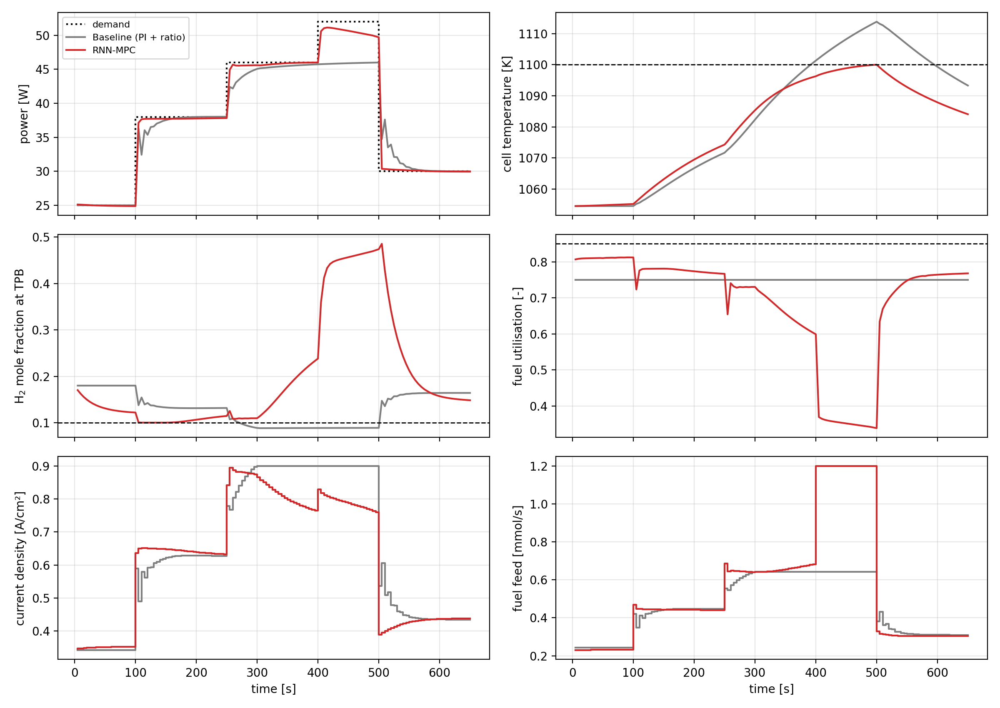

# SOFC-RNN-MPC

**Machine-learning-based model predictive control of a solid oxide fuel cell with dusty-gas porous-anode transport**

A dynamic first-principles SOFC model, with binary H₂/H₂O transport through the porous anode described by the dusty-gas model, generates training data for a GRU surrogate. The surrogate is embedded in a model predictive controller that tracks a power demand while keeping the cell below its temperature limit and preventing H₂ depletion at the triple-phase boundary (TPB).

📄 **Short report:** [`report/SOFC_RNN_MPC_report.pdf`](report/SOFC_RNN_MPC_report.pdf)



## Key results

| Closed loop on the first-principles plant (650 s) | PI + fixed utilisation | GRU-MPC |
|---|---|---|
| Power-tracking RMSE | 2.75 W | **0.64 W** |
| Max. cell temperature (limit 1100 K) | 1113.8 K | **1100.0 K** |
| Min. H₂ fraction at TPB (limit 0.10) | 0.089 | **0.101** |
| Time below TPB limit | 230 s | **0 s** |
| Electrical efficiency (LHV) | **34.6 %** | 29.6 % |

Surrogate accuracy on unseen test trajectories: R² ≥ 0.9998 for composition, temperature and TPB H₂ fraction. The MPC with the surrogate solves about 130× faster per step (85 s vs 0.64 s on the same machine) than the same MPC with the first-principles model.

## Quick start

```bash
pip install -r requirements.txt
python 00_operating_envelope.py   # steady operating map
python 01_generate_data.py        # simulation data
python 02_train_rnn.py            # train and test the GRU surrogate
python 03_closed_loop.py          # baseline vs GRU-MPC
python 04_fp_mpc_benchmark.py     # first-principles MPC benchmark (slow, checkpointed)
```

A trained model is included (`results/gru_surrogate.pt`), so `03_closed_loop.py` runs without steps 1–2.

## Repository

```
sofcmpc/sofc_model.py       first-principles SOFC model (DGM anode)
sofcmpc/data_generation.py  APRBS excitation
sofcmpc/rnn_surrogate.py    GRU surrogate and training
sofcmpc/mpc.py              MPC with GRU or first-principles predictor
report/                     two-page technical report
```

## Author

P Ramakrishnan — PhD (Chemical Engineering), NIT Rourkela. The implementation was developed with AI-assisted coding.

MIT License.
